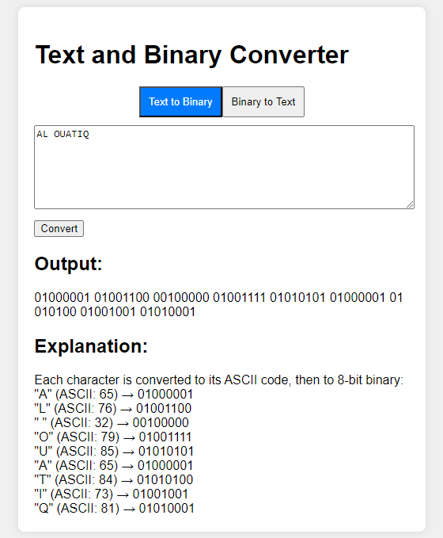

# Text and Binary Converter

## Overview

This project is a simple, interactive web-based tool that allows users to convert text to binary and vice versa. It provides an easy-to-use interface with real-time conversion and detailed explanations of the conversion process.

## Features

- Two-way conversion: Text to Binary and Binary to Text
- Interactive web interface
- Real-time conversion
- Input validation with helpful error messages
- Detailed explanation of the conversion process
- Responsive design for various screen sizes

## Demo



## Installation

1. Clone the repository:
   ```
   git clone https://github.com/alouatiq/text-binary-converter.git
   ```
2. Navigate to the project directory:
   ```
   cd text-binary-converter
   ```
3. Open the `index.html` file in your web browser.

No additional installation or setup is required as this is a client-side application.

## Usage

1. Open the `index.html` file in a web browser.
2. Choose the conversion mode:
   - "Text to Binary" to convert text into binary.
   - "Binary to Text" to convert binary back into text.
3. Enter your input in the text area:
   - For text input, enter any text.
   - For binary input, enter space-separated 8-bit binary numbers (e.g., "01101000 01101001").
4. Click the "Convert" button.
5. View the conversion result in the "Output" section.
6. Read the detailed explanation of the conversion process in the "Explanation" section.

## Technical Details

- The application is built using HTML, CSS, and JavaScript.
- Text to Binary conversion:
  - Each character is converted to its ASCII code.
  - The ASCII code is then converted to an 8-bit binary representation.
- Binary to Text conversion:
  - Each 8-bit binary group is converted to its decimal (ASCII) value.
  - The ASCII value is then converted to its corresponding character.

## Contributing

Contributions to improve the converter are welcome. Please feel free to submit a Pull Request.
